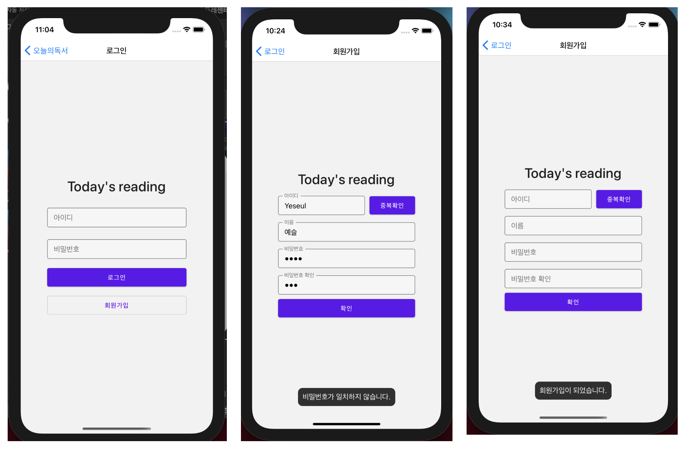
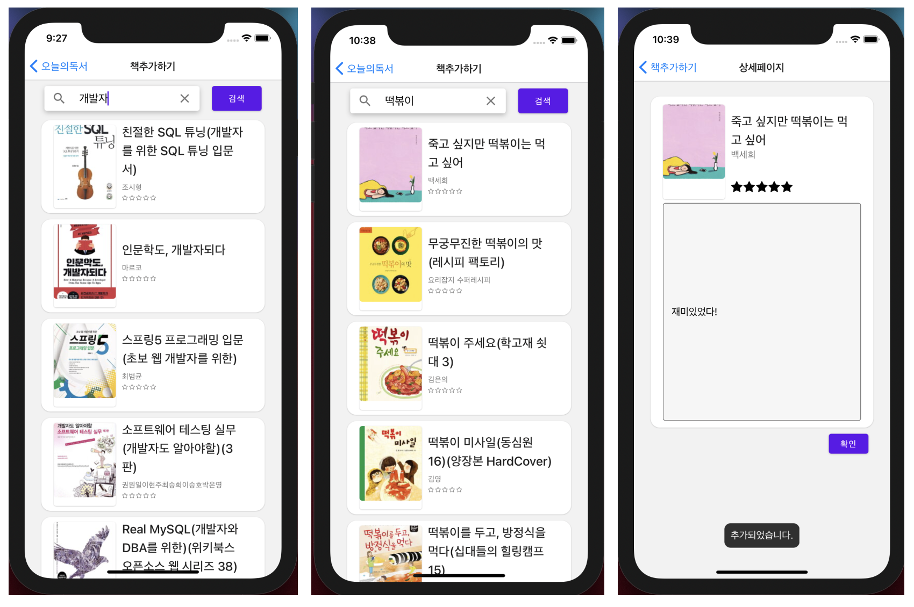
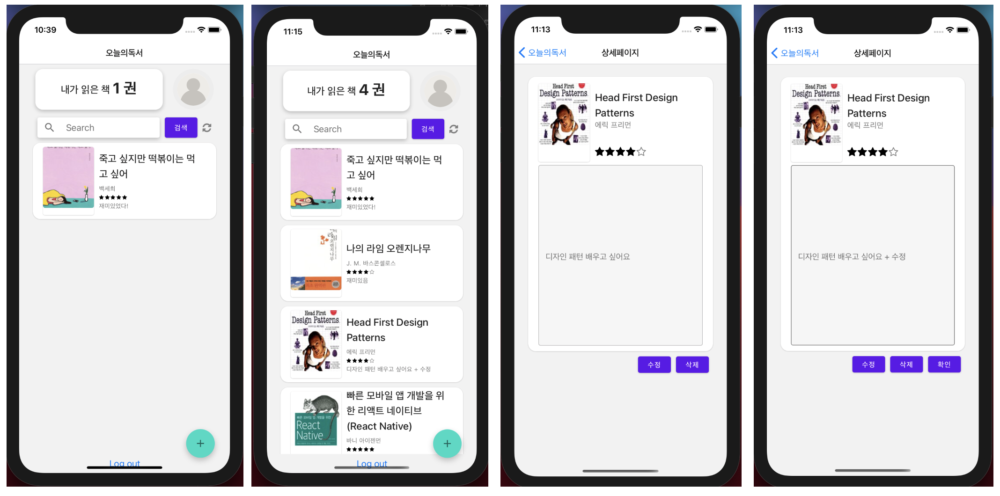
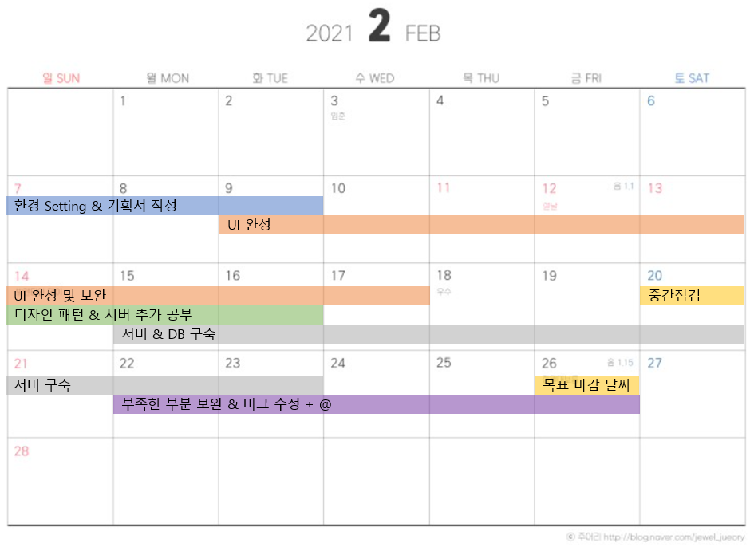

# Today's Reading (App)

평소 책을 읽고 덮은 뒤에 기록을 해 두지 않으면 어떤 책을 읽었는지, 어떤 생각을 했었는지 기억을 못할 때가 많습니다.
이를 위해 언제든 쉽게 기록 할 수 있는 앱, ```Today's Reading``` 이라는 앱을 기획하게 되었습니다.

해당 레포지토리는 어플을 만든 레포지토리이며, 서버를 위한 레포지토리는 [이곳](https://github.com/HongYeseul/todayzReading-server)에서 확인이 가능합니다.

> 해당 어플은 아이디어가 좋아서 앱을 만들기보다는,
> 3주 이내라는 짧은 기간 안에 만들기 위해 기능을 최대한 축소시켜
> 평소에 개발할 때 해보지 못했던 경험을 위해 기획하였으니 참고하셨으면 좋겠습니다.

## 세부 동작 이미지




## 개발 일정


## 사용 기술
- React Native
- Node.js [(해당 레포지토리 둘러보기)](https://github.com/HongYeseul/todayzReading-server)
- MySql
- Oracle Cloud
- Kakao 검색 API

## 개발 과정
- [기획안](https://velog.io/@yeseul/%ED%94%84%EB%A1%9C%EC%A0%9D%ED%8A%B8-Todays-reading-%EA%B8%B0%ED%9A%8D%EC%95%88)
- [1주차 중간점검](https://velog.io/@yeseul/%ED%94%84%EB%A1%9C%EC%A0%9D%ED%8A%B8-Todays-reading-%EC%A4%91%EA%B0%84%EC%A0%90%EA%B2%801)
- [2주차 중간점검](https://velog.io/@yeseul/%ED%94%84%EB%A1%9C%EC%A0%9D%ED%8A%B8-Todays-reading-%EC%A4%91%EA%B0%84%EC%A0%90%EA%B2%802)
- 결과보고서(추가예정)